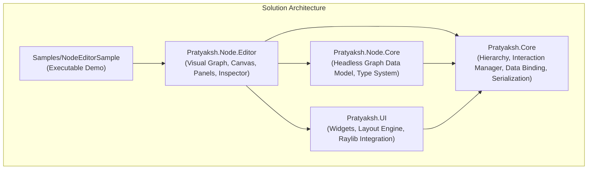

# Pratyaksh Library

[](https://dotnet.microsoft.com/)
[](https://github.com/Subtixx/Raylib-cs)
[](https://opensource.org/licenses/MIT)
[](https://github.com/Binary-Tantra/PratyakshLib)

**Pratyaksh** (*प्रत्यक्ष* — meaning *apparent, tangible, visual*) is a modular, high-performance C# GUI toolkit and node-graph editing system built on top of **.NET 10** and **[Raylib-cs](https://github.com/Subtixx/Raylib-cs)**. 

It provides an immediate/retained hybrid UI layout engine, an MVVM reactive two-way data-binding framework, a headless node data model, and an interactive canvas-based visual node editor.

---

## 🏛️ Solution Architecture & Packages

Pratyaksh is structured into 4 modular layers, separating core abstractions, UI components, headless domain logic, and visual editing tools.



| Package | Description | NuGet |
| :--- | :--- | :---: |
| [**`Pratyaksh.Core`**](Pratyaksh/Core/README.md) | Hierarchy primitives, input handling & gesture disambiguation, reactive 2-way data binding, and serialization. | [](https://www.nuget.org/packages/Pratyaksh.Core/) |
| [**`Pratyaksh.UI`**](Pratyaksh/UI/README.md) | Hybrid immediate/retained UI layout engine, 10 UI widgets, data-bound adapters, and Raylib host canvas. | [](https://www.nuget.org/packages/Pratyaksh.UI/) |
| [**`Pratyaksh.Node.Core`**](Pratyaksh/Node/Core/README.md) | Headless graph data model, dynamic type system, port connections, and graph variables (zero graphics dependencies). | [](https://www.nuget.org/packages/Pratyaksh.Node.Core/) |
| [**`Pratyaksh.Node.Editor`**](Pratyaksh/Node/Editor/README.md) | Interactive visual node editor with 2D camera, cubic bezier wires, node templates, property inspector, and JSON serialization. | [](https://www.nuget.org/packages/Pratyaksh.Node.Editor/) |

---

## ✨ Key Features

- 🎨 **Hybrid Immediate/Retained UI Layout**: Declarative layout ergonomics (`BeginHorizontal`, `BeginScrollView`, `SectionEx`) backed by persistent, retained widget lifecycles.
- ⚡ **Reactive Two-Way MVVM Data Binding**: Synchronize model variables with UI inputs automatically without manual event wiring.
- 🧠 **Pure Headless Graph Core**: Decoupled graph domain logic (`Graph`, `Node`, `Port`, `Variable`, `Connection`) suitable for CLI evaluation, unit tests, and backend processing.
- 🔌 **Visual Node Canvas**: 2D camera with panning and zooming, smooth cubic bezier wires with type-based color coding, and draggable node bodies.
- 🔀 **Configurable Node Flows**: Support for both horizontal (left-to-right) and vertical (top-to-bottom) execution flows, with dynamically hidable node headers.
- 🧩 **Embedded Node Widgets**: Place text labels, input fields, toggles, buttons, selectables, and nested groups directly inside node bodies.
- 🔍 **Integrated Tooling**: Fuzzy-search node palette, context menus, variable management panel, and property inspector.
- 💾 **Full JSON State Persistence**: Serialize and deserialize entire workspaces—including graph topologies, node positions, variable declarations, templates, and UI panel states.
- 🎯 **11 Ready-to-Use UI Widgets**: `Button`, `InputField`, `Dropdown`, `CycleSelector`, `ScrollView`, `Selectable`, `Toggle`, `LinkButton`, `AlertBanner`, `StatusBadge`, and `Slider`.

---

## 🚀 Quick Start

### 1. Running the Included Sample

Clone the repository and run the sample project:

```bash
git clone https://github.com/Binary-Tantra/PratyakshLib.git
cd PratyakshLib
dotnet run --project Samples/NodeEditorSample/NodeEditorSample.csproj
```

### 1.1 Sample 'Hello World'

```csharp
using Raylib_cs;
using Pratyaksh.UI;

namespace TestProject;

public class Program : DefaultRaylibEngine
{
    private DemoPanel demoPanel;

    public Program() : base(800, 600, "Test Project", null, true, Color.DarkGreen, false)
    {
        demoPanel = new DemoPanel(50, 50);
    }

    protected override void OnSetup()
    {
        uiElements.Add(demoPanel);
    }

    static void Main()
    {
        new Program().Start();
    }
}

```

### 2. Creating a Standalone UI Panel

```csharp
using Pratyaksh.Core;
using Pratyaksh.UI;
using Raylib_cs;

public class ControlPanel : UILayoutBase
{
    private int btnId = IdGen.GetNewID();
    private int toggleId = IdGen.GetNewID();
    private bool isChecked = true;

    protected override string PanelName => "ControlPanel";

    public ControlPanel(int x, int y, Drawable? parent = null) : base(x, y, 260, 180, parent) { }

    public override void OnDrawLayout()
    {
        layout.SectionEx("Controls", Width, Height,
            Raylib.Fade(Color.DarkGray, 0.8f),
            Raylib.Fade(Color.Gray, 0.7f),
            Color.White, 0.15f, false);

        layout.AddSpace(10);

        int heightBegin, heightEnd;
        layout.BeginHorizontalEx(0, (int)Position.X + 10);
        {
            heightBegin = layout.PosY();
            layout.BeginVerticalEx(15, (int)Position.Y + 35);
            {
                layout.BeginHorizontal(5);
                {
                    layout.Text("Toggle Option: ", 15, Color.White);
                    layout.Toggle(toggleId, isChecked, 50, 20, (t) => isChecked = t.IsOn, toggleId);
                }
                layout.EndHorizontal(20);

                layout.BeginHorizontal(10);
                {
                    layout.Button(btnId, "Click Me", 100, 28, (b) => Console.WriteLine("Button Clicked!"), btnId);
                }
                layout.EndHorizontal(28);
            }
            layout.EndVertical(Width);
            heightEnd = layout.PosY();
        }
        layout.EndHorizontal(heightEnd - heightBegin);
    }
}
```

### 3. Basic Node Editor Host

```csharp
using Pratyaksh.Node.Editor;

public class Program
{
    public static void Main(string[] args)
    {
        // Initialize node editor at 1024x576 resolution
        NodeEditorEngine engine = new(1024, 576);
        engine.Start();
    }
}
```

### 4. Registering Custom Node Templates

```csharp
using Pratyaksh.Node.Editor;
using Pratyaksh.UI;
using Raylib_cs;

// Register Math Add Node
NodeEditorEngine.NodeRegistry.RegisterNode(new NodeTemplate(
    name: "Math Add",
    category: "Math",
    inputPortTypeNames: ["Float", "Float"],
    outputPortTypeNames: ["Float"],
    uiElements: [
        (UIElementType.Text, new TextDesc("Computes: A + B", Color.White))
    ],
    flow: NodeFlow.Horizontal,
    showHeader: true
));

// Register an Interactive Node with an Embedded Input Field and Button
NodeEditorEngine.NodeRegistry.RegisterNode(new NodeTemplate(
    name: "Custom Node",
    category: "Custom",
    inputPortTypeNames: ["Execution", "String"],
    outputPortTypeNames: ["Execution"],
    uiElements: [
        (UIElementType.InputField, new InputFieldDesc("Enter value...", "", 140, 25)),
        (UIElementType.Button, new ButtonDesc("Execute", 140, 25, (btn) => Console.WriteLine("Executed!")))
    ],
    flow: NodeFlow.Vertical,
    showHeader: false
));
```

---

## ⌨️ Controls & Shortcuts

| Action | Shortcut / Input |
| :--- | :--- |
| **Pan Canvas** | Right Mouse Button Drag |
| **Zoom Canvas** | Mouse Wheel Scroll (Middle Click) |
| **Open Node Palette** | Right Click on empty canvas |
| **Node Context Menu** | Right Click on node visual |
| **Select Node / Variable** | Left Click |
| **Move Node** | Left Mouse Button Drag on node body |
| **Connect Ports** | Left Mouse Button Drag from output port to input port |
| **Save Graph** | `Ctrl + S` (exports to `save.json`) |
| **Load Graph** | `Ctrl + L` (imports from `save.json`) |

---

## 📦 NuGet Package Installation

Add the specific packages you need for your project:

```bash
# Core framework & data binding
dotnet add package Pratyaksh.Core

# UI component toolkit & Raylib host
dotnet add package Pratyaksh.UI

# Headless node graph data model
dotnet add package Pratyaksh.Node.Core

# Full visual node editor canvas
dotnet add package Pratyaksh.Node.Editor
```

---

## 🛠️ Requirements

- **.NET SDK**: `10.0+`
- **Supported OS**: Windows, Linux, macOS (via Raylib native binaries)

---

## 📄 License

This project is licensed under the [MIT License](LICENSE).

---

## 👤 Author & Company

- **Author**: Tushar Raturi
- **Company**: [Binary Tantra](https://github.com/Binary-Tantra)
- **Repository**: [https://github.com/Binary-Tantra/PratyakshLib](https://github.com/Binary-Tantra/PratyakshLib)